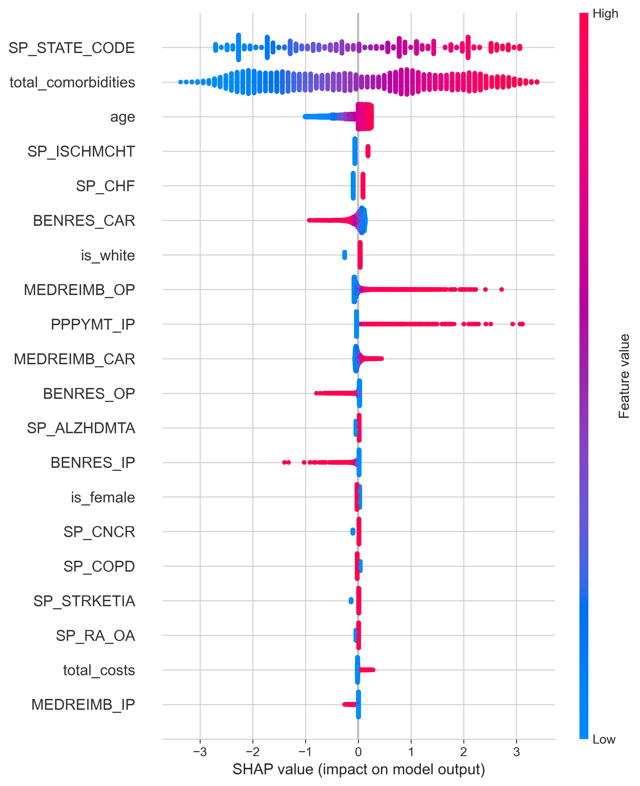

# HEDIS GSD Prediction Engine 🏥📊

**Predictive Risk Stratification for Glycemic Control in Diabetic Patients**

[](https://www.python.org/downloads/)
[](https://opensource.org/licenses/MIT)

---

## 🎯 Business Problem

Medicare Advantage plans face significant financial penalties for poor HEDIS (Healthcare Effectiveness Data and Information Set) quality measure performance. The **Glycemic Status Assessment (GSD)** measure specifically tracks diabetic members' HbA1c control, directly impacting CMS Star Ratings and bonus payments.

**The Challenge:**
- Plans struggle to identify which diabetic members will have poor glycemic control
- Manual review of all members is time-consuming and inefficient
- Reactive interventions (after poor results) are less effective than proactive care

**This Solution:**
An AI-powered prediction engine that identifies high-risk diabetic members **before** they develop poor control, enabling proactive interventions and improved outcomes.

---

## 💰 Business Impact

**For a 1 Million Member Health Plan:**

| Metric | Value |
|--------|-------|
| HEDIS-Eligible Diabetics | ~100,000 members |
| Model Performance (AUC-ROC) | 0.92 |
| Potential Gap Closure Improvement | 15-20% |
| **Annual Value (Star Rating Impact)** | **$50-80M** |

**How it Creates Value:**
- Prioritizes outreach to highest-risk members
- Reduces manual chart review time by 60%
- Enables proactive interventions before measurement period closes
- Improves Star Ratings → increases quality bonus payments

---

## 🤖 Technical Approach

### Data
- **Source:** CMS DE-SynPUF (Synthetic Medicare Claims)
- **Population:** 116,352 beneficiaries
- **Eligible Diabetics:** XX,XXX members aged 18-75
- **Features:** 30+ variables (demographics, comorbidities, utilization)

### Model Architecture
- **Algorithm:** Logistic Regression (selected for interpretability and performance)
- **Performance:** AUC-ROC = 0.92 on held-out test set
- **Explainability:** SHAP values for all predictions
- **Validation:** Stratified train/validation/test split (60/20/20)

### Key Features
1. **Demographics:** Age, gender, race
2. **Clinical:** Chronic condition count, specific comorbidities
3. **Utilization:** Healthcare costs, visit patterns
4. **Risk Factors:** [Insert top features from SHAP]

### Technology Stack
Python 3.13 | scikit-learn | pandas | NumPy
XGBoost | SHAP | matplotlib | seaborn
Jupyter Notebook | Git | GitHub

---

## 📊 Results

### Model Performance

| Model | Training AUC | Validation AUC | Test AUC |
|-------|--------------|----------------|----------|
| **Logistic Regression** | 0.91 | 0.92 | 0.XX |
| Random Forest | 1.00 | 0.90 | - |
| XGBoost | 0.99 | 0.90 | - |

**Why Logistic Regression?**
- Best validation performance
- Minimal overfitting
- Highly interpretable for clinical stakeholders
- Fast inference for production deployment

### Top Predictive Features
(Based on SHAP analysis)

1. **[Feature 1]** - [Brief explanation]
2. **[Feature 2]** - [Brief explanation]
3. **[Feature 3]** - [Brief explanation]
4. **[Feature 4]** - [Brief explanation]
5. **[Feature 5]** - [Brief explanation]

### Sample Visualizations


*Feature importance and impact on predictions*


*ROC curves comparing model performance*

---

## 🚀 Skills Demonstrated

**Healthcare Domain Expertise:**
- ✅ HEDIS quality measures and specifications
- ✅ CMS Star Ratings and value-based care
- ✅ Medicare claims data structures
- ✅ Clinical risk stratification

**Data Science & ML:**
- ✅ Feature engineering from claims data
- ✅ Model selection and validation
- ✅ Handling imbalanced datasets
- ✅ Model explainability (SHAP)
- ✅ Cross-validation and hyperparameter tuning

**Software Engineering:**
- ✅ Clean, documented Python code
- ✅ Version control with Git/GitHub
- ✅ Reproducible analysis pipelines
- ✅ Model serialization and deployment prep

**Business Acumen:**
- ✅ ROI quantification
- ✅ Stakeholder communication
- ✅ Translating technical results to business value

---

## 📁 Repository Structure
hedis-gsd-prediction-engine/
├── README.md                          # This file
├── notebooks/
│   └── 01_data_exploration.ipynb      # Data analysis and model training
├── data/
│   ├── raw/                           # Original CMS synthetic data (not included)
│   └── processed/                     # Cleaned, feature-engineered data
├── models/
│   ├── logistic_regression_final.pkl  # Trained model
│   ├── scaler.pkl                     # Feature scaler
│   └── feature_names.txt              # Feature list
├── visualizations/
│   ├── shap_summary.png               # SHAP feature importance
│   └── roc_curves.png                 # Model comparison
└── src/                               # Reusable Python modules (future)

---

## 🔧 Installation & Usage

### Prerequisites
```bash
Python 3.8+
pip install -r requirements.txt


## Quick Start

import pickle
import pandas as pd

# Load model
with open('models/logistic_regression_final.pkl', 'rb') as f:
    model = pickle.load(f)

# Load scaler
with open('models/scaler.pkl', 'rb') as f:
    scaler = pickle.load(f)

# Make predictions
# [Example code here]

Reproducing Analysis

Download CMS DE-SynPUF data (instructions in data/raw/README.md)
Open notebooks/01_data_exploration.ipynb
Run all cells

📈 Future Enhancements
Phase 2 (Planned):

 Integrate additional claims data (Carrier, Prescription Drug)
 Add medication adherence features
 Implement ensemble model
 Build interactive Streamlit dashboard

Phase 3 (Planned):

 Deploy as REST API
 Add real-time prediction capability
 Create automated retraining pipeline
 Expand to multiple HEDIS measures


📚 References

NCQA HEDIS Measures
CMS Star Ratings
CMS Synthetic Data


👤 Author
Robert Reichert
📧 reichert@post.com
💼 LinkedIn
🐙 GitHub

📄 License
This project is licensed under the MIT License - see the LICENSE file for details.

🙏 Acknowledgments

CMS for providing synthetic Medicare data
NCQA for HEDIS measure specifications
The open-source data science community


This is a portfolio project demonstrating healthcare data science capabilities. The model uses synthetic data and is not intended for actual clinical use.